Myrio Text
===
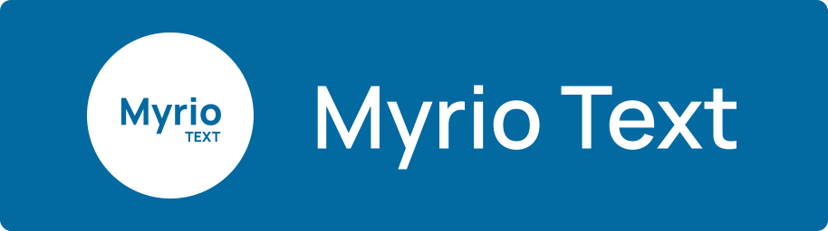

Myrio Text lets you encode your text in the form of an image, and decode it back to text. It's a fun way to share secret
messages with your friends.


Try it out at [myrio.now.sh](https://myrio.now.sh/)

<!-- accordian for screenshots, 2 section, desktop and mobile devices -->
<details>
  <summary>
    <h3>View Screenshots</h3>
  </summary>
  <div>
    <details>
      <summary>
        <h4>Desktop</h4>
      </summary>
      <div>
        <figure>
          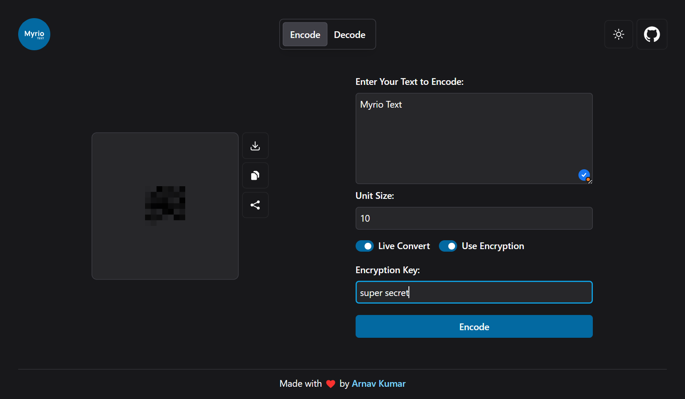
          <figcaption>Encrypting Data - Dark Theme</figcaption>
        </figure>
        <figure>
          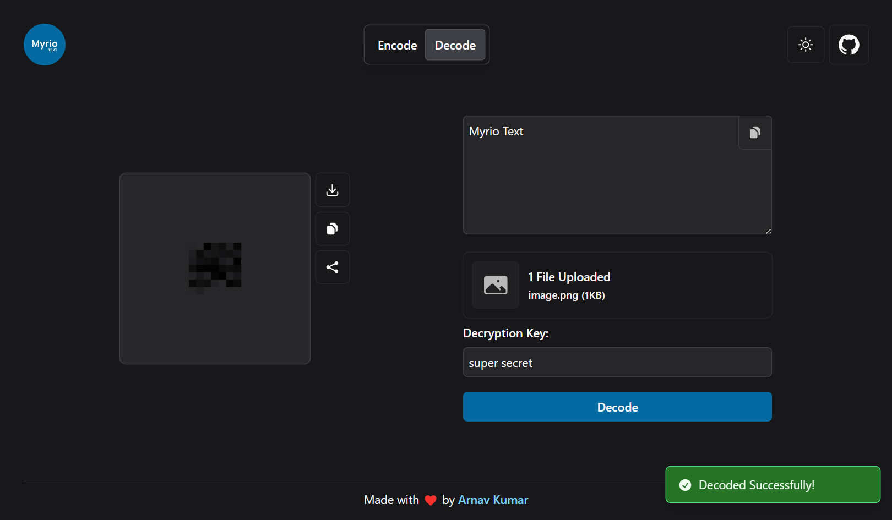
          <figcaption>Decrypting Data - Dark Theme</figcaption>
        </figure>
        <figure>
          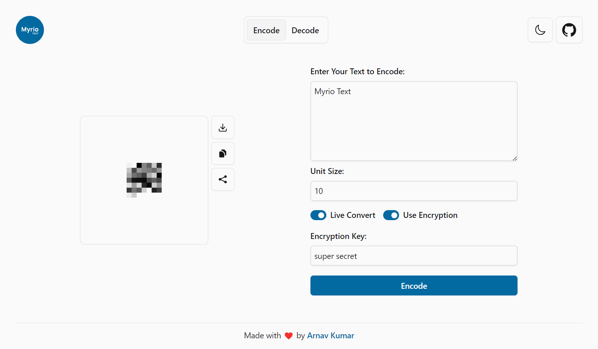
          <figcaption>Encrypting Data - Light Theme</figcaption>
        </figure>
        <figure>
          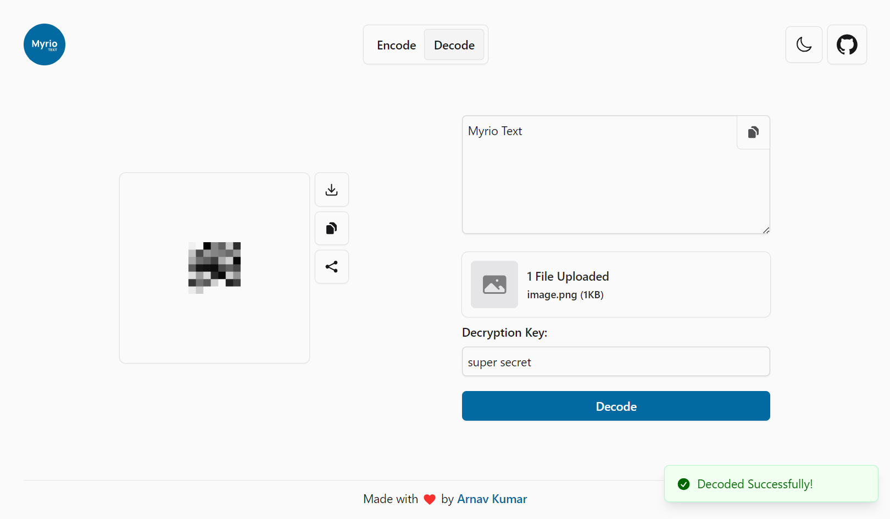
          <figcaption>Decrypting Data - Light Theme</figcaption>
        </figure>
        <figure>
          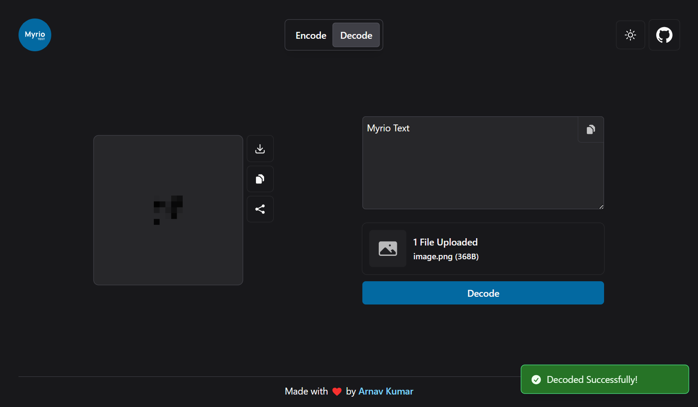
          <figcaption>Decoding Data - Dark Theme</figcaption>
        </figure>
      </div>
    </details>
    <details>
      <summary>
        <h4>Mobile</h4>
      </summary>
      <div>
        <figure>
          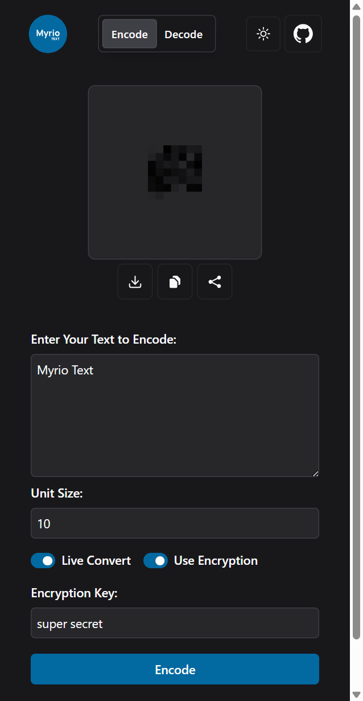
          <figcaption>Encrypting Data - Dark Theme</figcaption>
        </figure>
        <figure>
          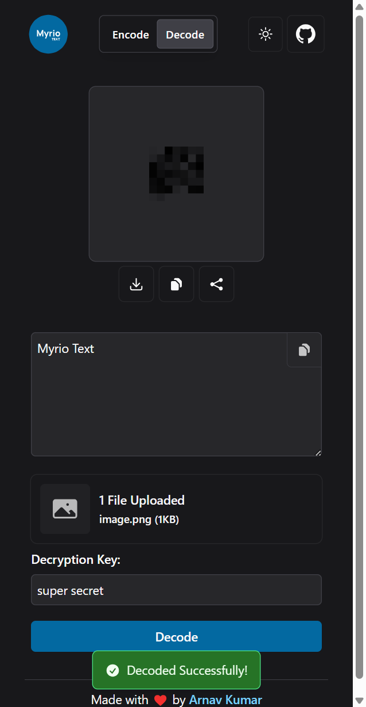
          <figcaption>Decrypting Data - Dark Theme</figcaption>
        </figure>
        <figure>
          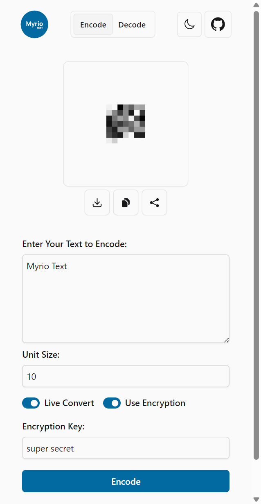
          <figcaption>Encrypting Data - Light Theme</figcaption>
        </figure>
        <figure>
          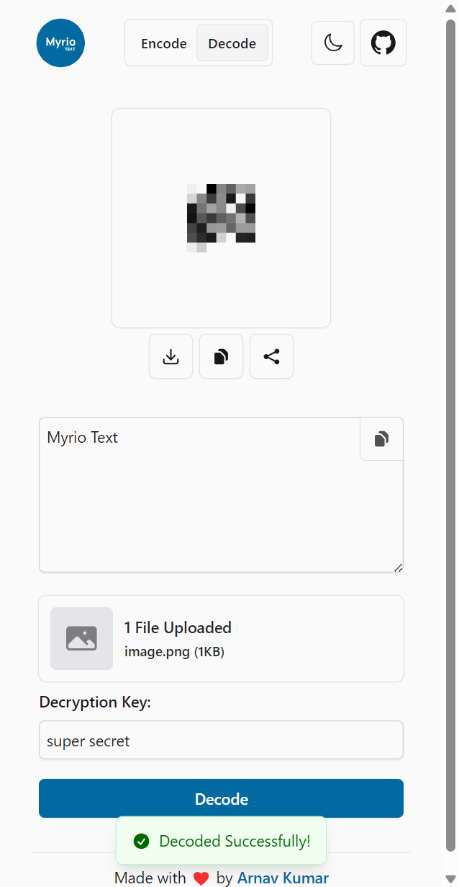
          <figcaption>Decrypting Data - Light Theme</figcaption>
        </figure>
        <figure>
          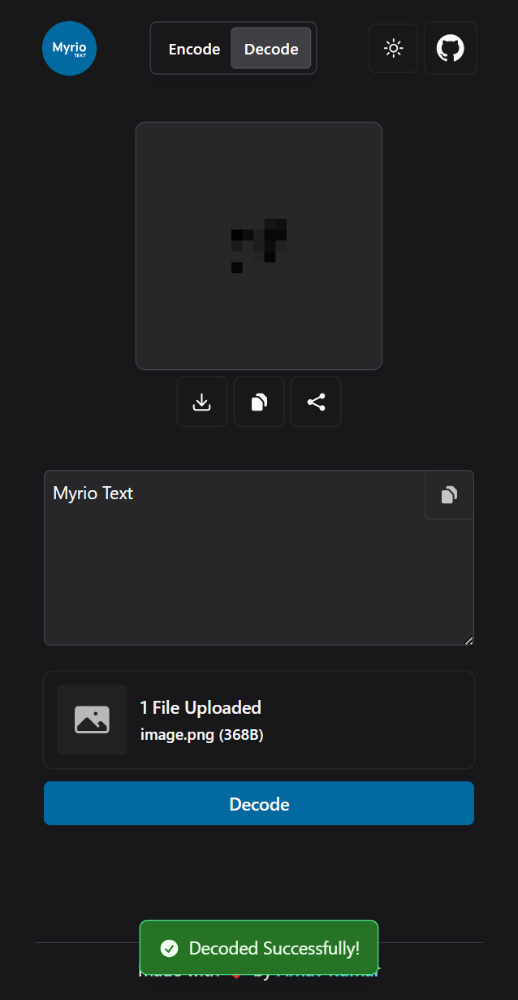
          <figcaption>Decoding Data - Dark Theme</figcaption>
        </figure>
      </div>
    </details>
  </div>
</details>


## Features
- Encode text to an image
- Decode text from an image
- Encrypted encoding and decoding using AES-256 and user provided password
- Copy, Download and Share the encoded image
- Live generation of the encoded image as you type
- Responsive design
- Dark mode
- Controls for Advanced uses using url parameters
- Offline support

> [!TIP]
> Install the PWA for offline support and a native app like experience. using the install button at the bottom right
corner of the page.

> [!TIP]
> When PWA is installed, on mobile devices, to decode, you can directly share the image to Myrio Text from the share
menu.\
> when on PC, you can use `Open With` option in the context menu of the image to open it in Myrio Text.\
> (provided your browser supports it)

## Advanced Usage
Myrio Text supports passing parameters in the URL to control the encoding and decoding process. All the process that can
be done in UI can directly be done using the URL parameters. The parameters are:
- `mode: 0|1` - The mode of operation. `0` for `encode`, `1` for `decode`.
- `live: 0|1` - The live generation of the encoded image as you type..
- `encrypted: 0|1` - The encryption of the encoded text.
- `text: string` - The text to be encoded.
- `image: string` - The image to be decoded.
- `key: string` - The key for encryption/decryption. either `text` or `image` paramaters should be present for it to
work.
- `unit_size: number` - The size of the unit in pixels. Default is `10`.

An example URL would be:
```
https://myrio.now.sh/?text=Hello%20World&encrypted=1&key=top_secret
```
this would encode the text `Hello World` with encryption using the key `top_secret`

## Authors
- Arnav Kumar ([@arnav-kr](https://github.com/arnav-kr))

## License
This project is licensed under the AGPL-3.0 License - see the [LICENSE](LICENSE) file for details.